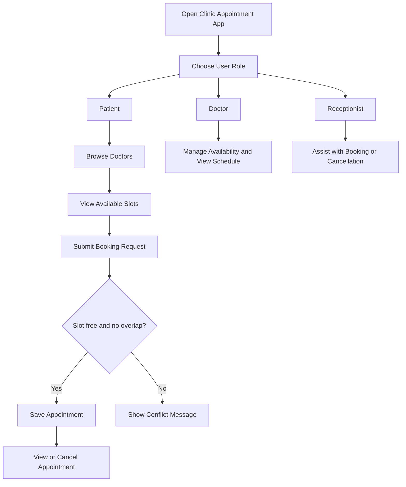

# System Workflow

```mermaid
flowchart TD
    A[Open Clinic Appointment App] --> B[Choose User Role]
    B --> C[Patient]
    B --> D[Doctor]
    B --> E[Receptionist]
    C --> F[Browse Doctors]
    F --> G[View Available Slots]
    G --> H[Submit Booking Request]
    H --> I{Slot free and no overlap?}
    I -- Yes --> J[Save Appointment]
    I -- No --> K[Show Conflict Message]
    J --> L[View or Cancel Appointment]
    D --> M[Manage Availability and View Schedule]
    E --> N[Assist with Booking or Cancellation]
```

This diagram describes intended workflows. It does not indicate that all workflows are implemented.
